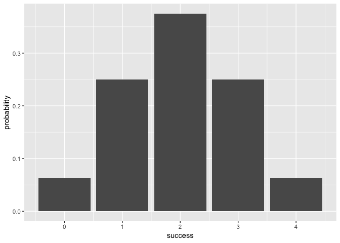
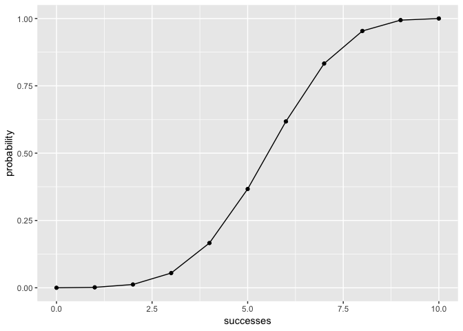

README
================
Antara Jha
4/30/2019

Overview
--------

------------------------------------------------------------------------

"binomial" is an R package that provides functions to compute basic probability functions and see plot the results of those computations.

-   bin\_variable() creates a binomial variable object of class "binvar".
-   summary.binvar() displays the summary statistics of a particular binomial variable of class "binvar".This summary include the:
    -   mean
    -   variance
    -   mode
    -   skewness
    -   kurtosis of the probability districution of the binomial variable.

Motivation
----------

------------------------------------------------------------------------

This package has been developed for the purpose of a class project to illustrate the concepts behind the creation of an R package.

Usage
-----

------------------------------------------------------------------------

``` r
library(binomial)
library(DistributionUtils)
library(ggplot2)
# Building a random variiable, seeing its summary statistics
example_variable = bin_variable(4, 0.4)
example_variable
```

    ## "Binomial Variable" 
    ## 
    ## Paramaters 
    ## - number of trials: 4 
    ## - prob of success : 0.4

``` r
summary(example_variable)
```

    ## "Summary Binomial" 
    ## 
    ## Paramaters 
    ## - number of trials: 4 
    ## - prob of success : 0.4 
    ## 
    ## Measures 
    ## - mean: 1.6 
    ## - variance: 0.96 
    ## - mode: 2 
    ## - skewness: 0.204124145231931 
    ## - kurtosis: -0.458333333333334

``` r
# Creating a sample probability distribution by inputing number of successes, trials and probability
bin_probability(3, 4, 0.75)
```

    ## [1] 0.421875

``` r
# Viewing the probability distribution
ex_distribution = bin_distribution(4, 0.5)
# Plotting the distribution to study it visually
plot.bindis(ex_distribution)
```



``` r
#Creating a cumulative probability distribution, and plotting it
ex_cum = bin_cumulative(10, 0.6)
plot.bincum(ex_cum)
```


